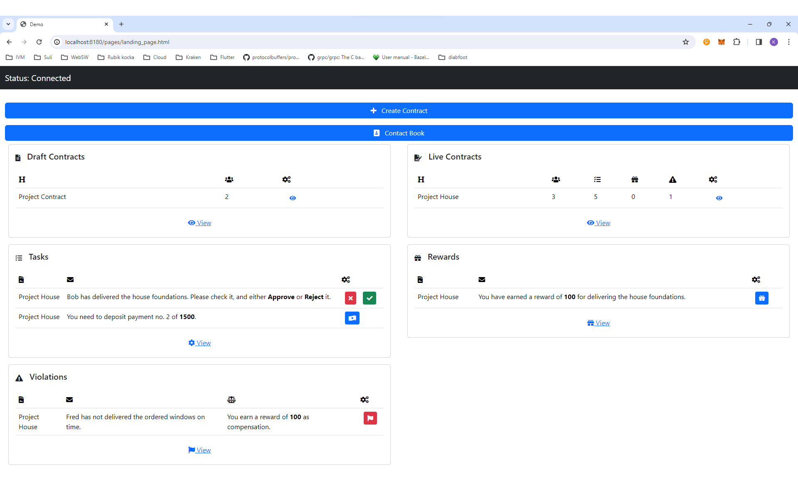
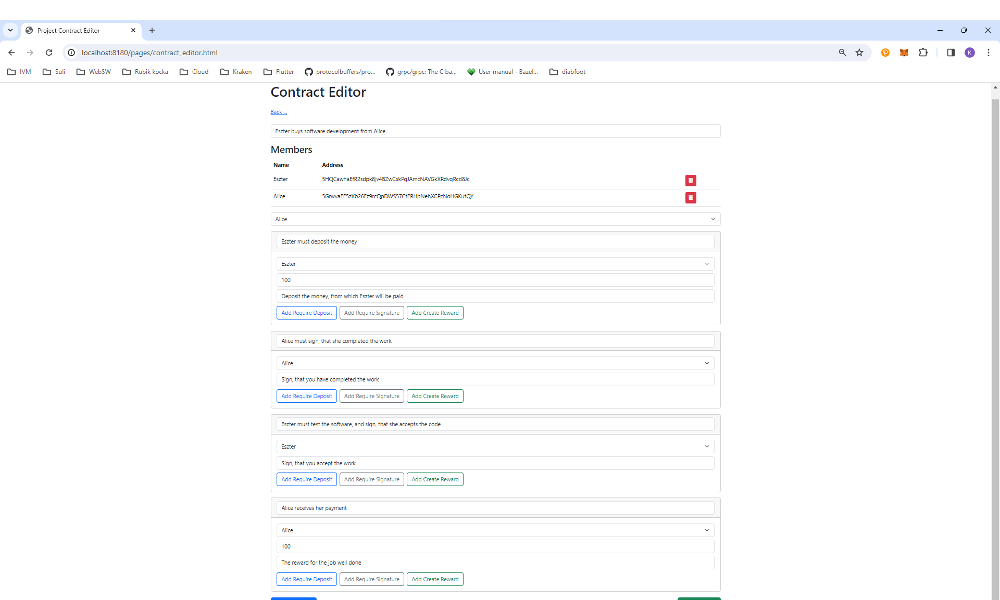
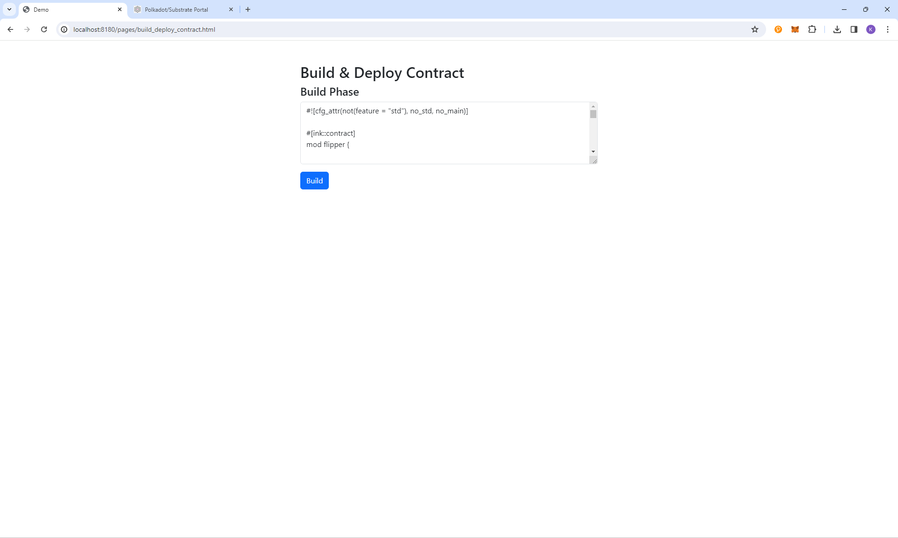
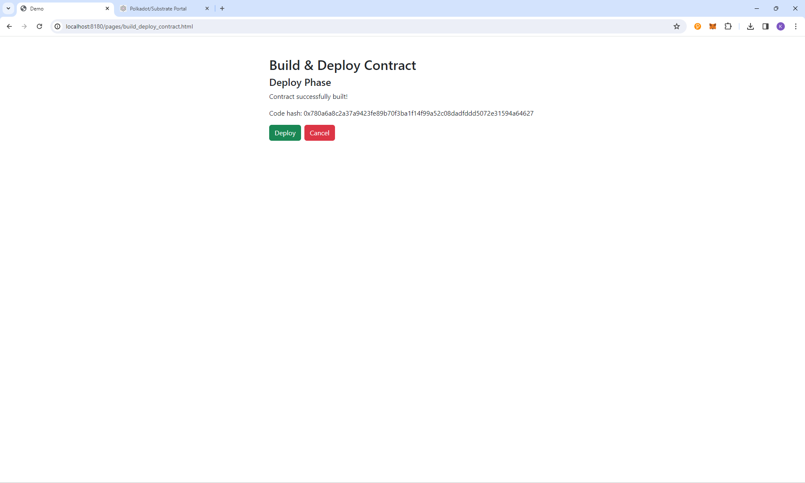
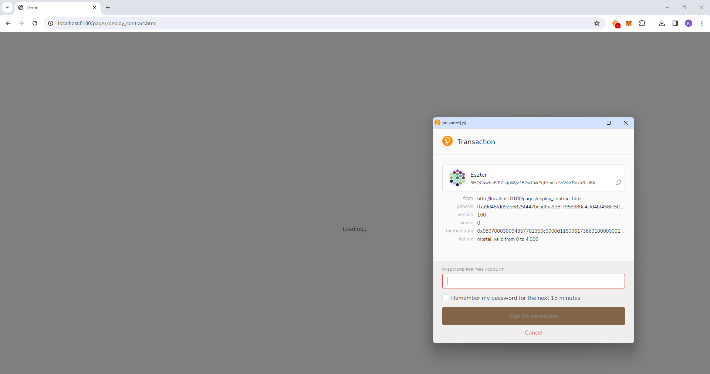
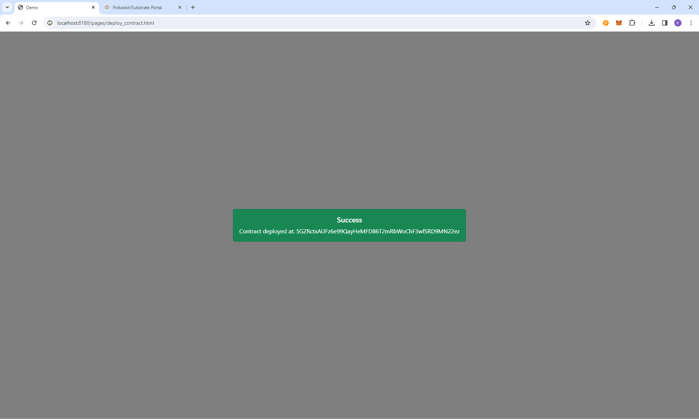
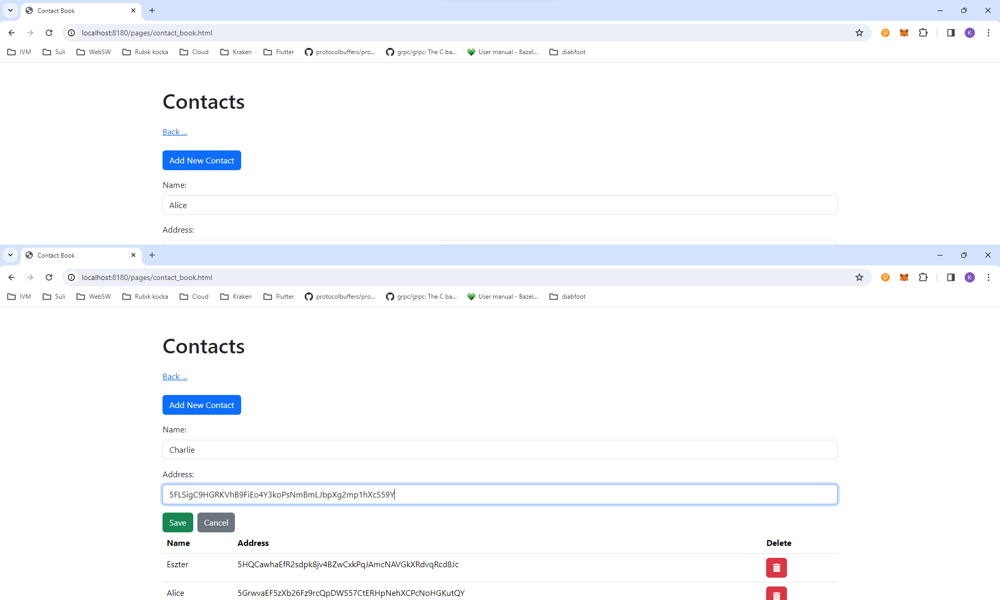
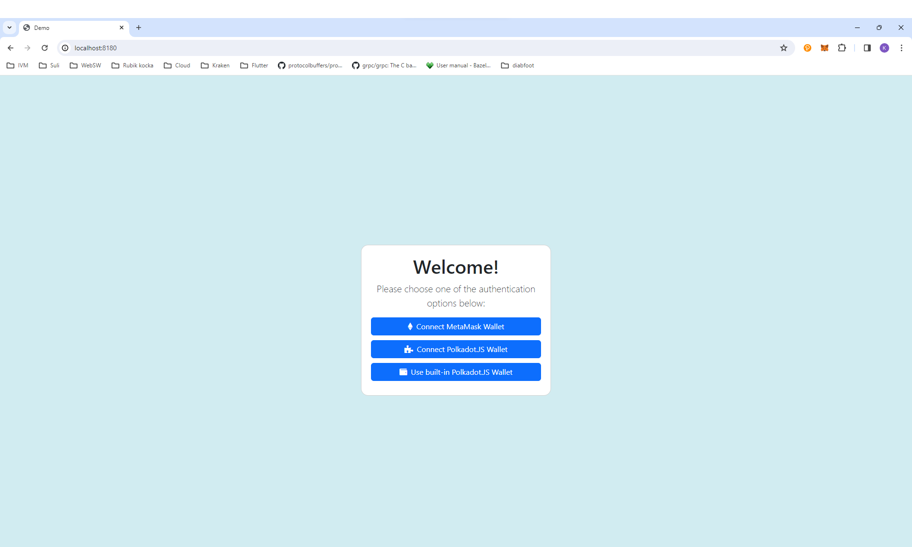
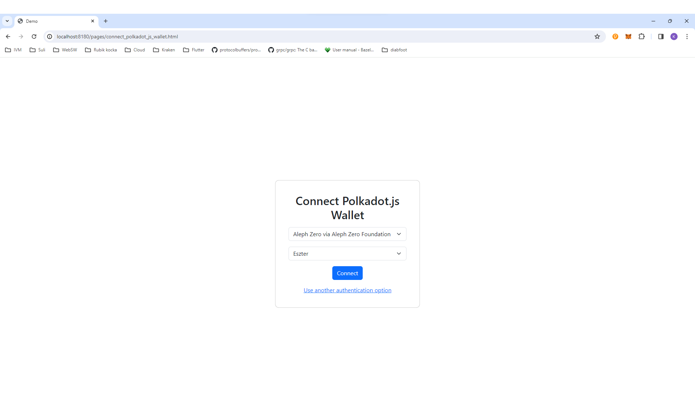

# Contracter

_Contracter is a web3 application, that allows users to create contracts using a simple user interface, and interact with them as well. The created contracts may support many interesting financial features, such as requiring a deposit, or sending a reward to someone._

* [YouTube Video](#)
* [Live Demo](https://contracter-degenhack-2024-ux.surge.sh)

# Screenshots

# Development

Source code in this repository is structured as follows:

* `ux/` - contains the current user interface (started as a UX prototype). It consumes the `lib-*` packages in standalone `.html` files, that can be served as-is. These micro-frontend applications make up the UI for now.
* `packages/*` - various packages in an NPM mono-repository. Most importantly, here reside the `lib-*` packages, which are built as _IIFE bundles_, and exported as global variables when included in an HTML page.
    * `lib-contact-book/`, `lib-contract-registry/`, `lib-contract-deployer/`, `lib-contract-editor/`, `lib-web3-init`
    * `video-generator/` - a python-based OpenAI video generator thingy
* `contracter-builder/` - the "contract compiler server" - a container that includes the build tooling necessary to build smart contracts, and a web service for exposing building functionality (returns WASM + ABI JSON contract bundle).

To recompile the IIFE libraries, run `npm run -w @degenhack/lib-contact-book build` (or any other package name).

To serve the UX prototype, run `npm run -w @degenhack/ux start`

To build the contracter-builder, run `docker build -t contracter-builder:latest -f ContracterBuilder.Dockerfile contracter-builder/`

To run the contracter-builder, you are supposed to send a `POST` request to `/build/{projectname}`. In the POST request body, send the ink! Rust code of the `lib.rs` of your contract. You will receive the built `.contract` JSON file contents.

# Completion Status

* UX prototype
    * Shows what authentication options are available
    * Shows how the landing page should work
    * Partially implemented contract editor UI behaviour
    * UX proof-of-concept for showing how build - deploy phase works
* Actually working login using Polkadot.JS
* Actually working contract deployment page, deploys a flipper contract
* Actually working contract builder backend service
* Some amount of documentation
